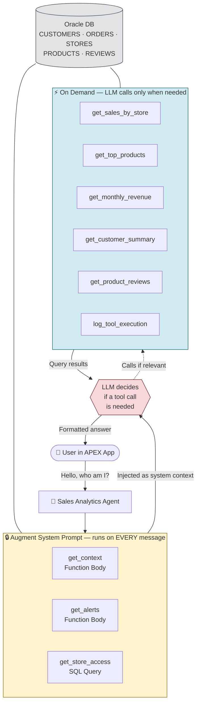
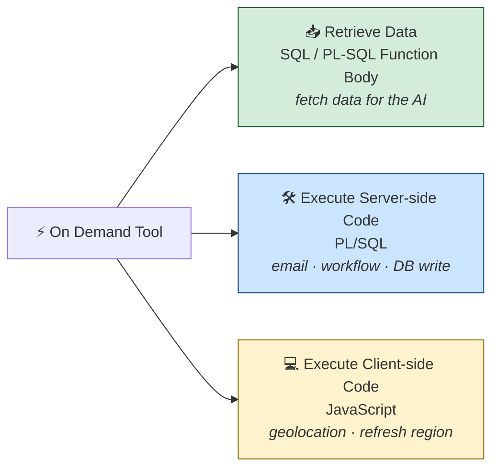
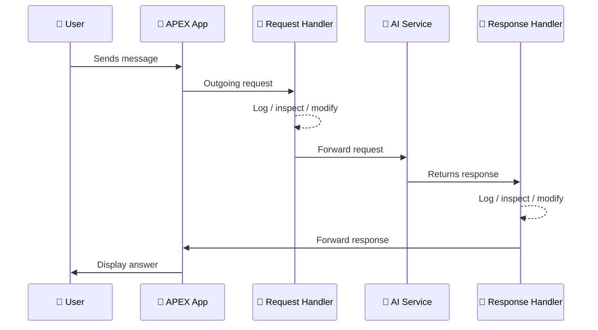

<div align="center">

# 🤖 Oracle APEX 26.1 — Generative AI Agent with Sales Analytics

**A complete, structured build guide for creating a Generative AI Agent in Oracle APEX 26.1**, using the Oracle sample sales dataset (stores, products, customers, orders) as the data source.


</div>

---

## 🗺️ Architecture at a Glance



---

## 📑 Table of Contents

1. [What's New in APEX 26.1](#1-whats-new-in-apex-261)
2. [Tool Execution Points](#2-tool-execution-points)
3. [Agent Configuration](#3-agent-configuration)
4. [System Prompt](#4-system-prompt)
5. [Augment System Prompt Tools](#5-augment-system-prompt-tools)
6. [On Demand Tools](#6-on-demand-tools)
7. [Audit Logging](#7-audit-logging)
8. [Tool Configuration Options](#8-tool-configuration-options)
9. [Request & Response Handlers](#9-request--response-handlers)
10. [Test Prompts](#10-test-prompts)
11. [Key Takeaways](#11-key-takeaways)

---

## 1. What's New in APEX 26.1

APEX 26.1 introduces the **Generative AI Agent** as a first-class Shared Component — a reusable, configurable AI assistant that can hold natural-language conversations inside an application and query the database through **tools**, deciding for itself when a tool is needed and what to pass into it.

An agent can be surfaced in several ways:

| Method | Where it's used |
|---|---|
| 🖼️ **Show AI Assistant** Dynamic Action | Renders the chat UI on a page |
| ✍️ **Generate Text With AI** Dynamic Action | Generates text client-side (e.g. into an item) |
| ⚙️ **Generate Text With AI** Page Process *(new in 26.1)* | Generates text server-side during page processing |
| 🧩 `APEX_AI.generate` / `APEX_AI.chat` (PL/SQL) | Programmatic / headless calls |

Every agent is defined by:

| Property | Purpose |
|---|---|
| System Prompt | Permanent behavioral instructions |
| Welcome Message | First message shown to the user |
| Temperature | Controls response creativity/determinism |
| Response Format *(new in 26.1)* | Output shape (e.g. Text) |
| Tools | The agent's data/action capabilities |

> ⚠️ **Naming note:** "Augment System Prompt" existed pre-26.1 under the name **RAG Sources** — it was renamed. **On Demand** tools are genuinely new in 26.1.

> 📸 *Add a screenshot of `Shared Components → Generative AI → AI Agents` here — save it to `docs/images/agent-list.png` and reference it as ``.*

---

## 2. Tool Execution Points

Every tool attached to an agent runs at one of two execution points. Understanding the difference is the single most important design decision when building an agent.

| | 🔒 **Augment System Prompt** | ⚡ **On Demand** *(new in 26.1)* |
|---|---|---|
| **Executes** | Always, before every request | Only when the LLM decides to call it |
| **Purpose** | Inject context (RAG) | Retrieve data *or* perform an action |
| **Result role** | System | Tool |
| **Accepts parameters** | No | Yes |
| **User approval support** | No | Yes |
| **Notification support** | No | Yes |
| **Guaranteed to run** | ✅ Yes | ❌ No |

**On Demand implementation types:**



> 💡 Inside an *Execute Server-side Code* tool, call `APEX_AI.set_tool_result` to override the default value returned to the AI.

---

## 3. Agent Configuration

**Navigate to:** `Shared Components → Generative AI → AI Agents → Create`

| Setting | Value |
|---|---|
| Name | `Sales Analytics Agent` |
| Static ID | `sales-analytics-agent` |
| Service | OpenAI ChatGPT |
| Response Format | Text |
| Temperature | `0.3` (low — favors consistent, factual answers) |

> 📸 *Add a screenshot of the **Create Agent** form here → `docs/images/agent-config.png`*

---

## 4. System Prompt

```text
You are a Sales Analytics Assistant for this demo application.

Answer questions about sales, revenue, products, customers and stores
using the available tools.

Always address the logged-in user by their first name using context
provided by get_context tool.

When user asks about their own orders or spending, filter data using
their email from the context.

For general sales questions use On Demand tools.

Always present data in clean formatted tables.
Use $ prefix for all currency values.
Keep responses concise and professional.
```

---

## 5. Augment System Prompt Tools

These three tools run before **every** message and combine into a picture of the current user and business state.

| # | Tool | Type | Max Tokens | What it does |
|---|---|---|---|---|
| 1 | `get_context` | Function Body | 500 | Looks up the logged-in user from `CUSTOMERS`, returns name/email/order history, instructs the AI to greet them by first name |
| 2 | `get_alerts` | Function Body | 500 | Flags products with no completed orders in 3 months, and stores inactive for 30+ days |
| 3 | `get_store_access` | SQL Query | 500 | Returns only the stores the current user has ordered from (role-based data access) |

<details>
<summary><b>5.1 <code>get_context</code></b> — Execution Point: Augment System Prompt · Type: Function Body · Max Tokens: 500</summary>

```sql
DECLARE
    l_clob           CLOB;
    l_full_name      VARCHAR2(255);
    l_email          VARCHAR2(255);
    l_order_count    NUMBER;
    l_total_spent    NUMBER;
    l_err            VARCHAR2(4000);
BEGIN
    SELECT FULL_NAME, EMAIL_ADDRESS
    INTO   l_full_name, l_email
    FROM   CUSTOMERS
    WHERE  UPPER(EMAIL_ADDRESS) = UPPER(V('APP_USER'));

    SELECT COUNT(DISTINCT ORDER_ID), NVL(SUM(ORDER_TOTAL), 0)
    INTO   l_order_count, l_total_spent
    FROM   CUSTOMER_ORDER_PRODUCTS
    WHERE  UPPER(EMAIL_ADDRESS) = UPPER(V('APP_USER'));

    INSERT INTO AI_TOOL_LOG (TOOL_NAME, EXECUTED_BY, PARAMETERS)
    VALUES ('get_context', V('APP_USER'), 'Augment System Prompt');
    COMMIT;

    l_clob :=
        '=== CURRENT USER CONTEXT ===' || CHR(10) ||
        'Logged In User  : ' || l_full_name                              || CHR(10) ||
        'Email           : ' || l_email                                  || CHR(10) ||
        'Current Date    : ' || TO_CHAR(SYSDATE, 'DD-Mon-YYYY HH24:MI') || CHR(10) ||
        CHR(10) ||
        '=== USER ORDER HISTORY ===' || CHR(10) ||
        'Total Orders    : ' || l_order_count                            || CHR(10) ||
        'Total Spent     : $'|| TO_CHAR(l_total_spent,'999,999,990.00') || CHR(10) ||
        CHR(10) ||
        '=== INSTRUCTIONS ===' || CHR(10) ||
        'Always address the user by first name: ' || l_full_name         || CHR(10) ||
        'When user asks about my orders filter by email: ' || l_email    || CHR(10) ||
        'For general sales questions use the On Demand tools.';

    RETURN l_clob;

EXCEPTION
    WHEN NO_DATA_FOUND THEN
        l_err := 'Customer not found for: ' || V('APP_USER');
        INSERT INTO AI_TOOL_LOG (TOOL_NAME, EXECUTED_BY, PARAMETERS)
        VALUES ('get_context', V('APP_USER'), l_err);
        COMMIT;
        RETURN 'Current User: ' || NVL(V('APP_USER'), 'Guest') || CHR(10) ||
               'Current Date: ' || TO_CHAR(SYSDATE, 'DD-Mon-YYYY HH24:MI');
    WHEN OTHERS THEN
        l_err := SQLERRM;
        INSERT INTO AI_TOOL_LOG (TOOL_NAME, EXECUTED_BY, PARAMETERS)
        VALUES ('get_context', V('APP_USER'), l_err);
        COMMIT;
        RETURN 'Context unavailable: ' || l_err;
END;
```

> ⚠️ **Setup requirement:** APEX workspace usernames are rarely real customer emails. Insert a matching row into `CUSTOMERS` for every APEX user you plan to test with — e.g. if you log in as `ADMIN`, insert a customer row with `EMAIL_ADDRESS = 'ADMIN'`.

</details>

<details>
<summary><b>5.2 <code>get_alerts</code></b> — Execution Point: Augment System Prompt · Type: Function Body · Max Tokens: 500</summary>

Scans for:
- Products with **no completed orders in the last 3 months**
- Stores with **no activity in the last 30 days**

Results are injected into the system prompt so the agent proactively surfaces alerts without being asked.

</details>

<details>
<summary><b>5.3 <code>get_store_access</code></b> — Execution Point: Augment System Prompt · Type: SQL Query · Max Tokens: 500</summary>

```sql
SELECT S.STORE_NAME, S.PHYSICAL_ADDRESS, S.WEB_ADDRESS
FROM   STORES S
WHERE  S.STORE_ID IN (
    SELECT DISTINCT O.STORE_ID
    FROM   ORDERS O
    JOIN   CUSTOMERS C ON C.CUSTOMER_ID = O.CUSTOMER_ID
    WHERE  UPPER(C.EMAIL_ADDRESS) = UPPER(V('APP_USER'))
)
ORDER BY S.STORE_NAME
```

</details>

---

## 6. On Demand Tools

Five tools cover the main analytics scenarios. All five are **SQL Query** type — the standard, simplest approach in 26.1. The **Description** field is what the LLM reads to decide *when* to call each tool, so it must describe the question in plain business language, not database terms.

| # | Tool | Parameters | Triggers on |
|---|---|---|---|
| 4 | `get_sales_by_store` | — | Sales by store, store revenue, store comparison |
| 5 | `get_top_products` | `P_LIMIT` (NUMBER, default 10) | Top/best-selling/highest-revenue products |
| 6 | `get_monthly_revenue` | `P_MONTHS` (NUMBER, default 12) | Revenue trends, monthly performance, time-based sales |
| 7 | `get_customer_summary` | `P_LIMIT` (NUMBER, default 10) | Top customers, customer spending, rankings |
| 8 | `get_product_reviews` | `P_PRODUCT_NAME` (VARCHAR2, optional) | Reviews, ratings, customer feedback |
| 9 | `log_tool_execution` | `P_TOOL_NAME`, `P_PARAMETERS` (VARCHAR2) | Demonstrates a server-side action tool |

<details>
<summary><b>6.1 <code>get_sales_by_store</code></b></summary>

**Description:** Use when the user asks about sales performance by store, store revenue, store comparison, which store sells the most, or any location-based sales question.

**Data Description:** Total sales per store — complete, paid, and shipped amounts, total revenue and order count, highest revenue first.

```sql
SELECT
    STORE_NAME,
    ADDRESS,
    SUM(CASE WHEN ORDER_STATUS = 'COMPLETE' THEN TOTAL_SALES ELSE 0 END) AS COMPLETE_SALES,
    SUM(CASE WHEN ORDER_STATUS = 'PAID'     THEN TOTAL_SALES ELSE 0 END) AS PAID_SALES,
    SUM(CASE WHEN ORDER_STATUS = 'SHIPPED'  THEN TOTAL_SALES ELSE 0 END) AS SHIPPED_SALES,
    SUM(TOTAL_SALES)  AS TOTAL_SALES,
    SUM(ORDER_COUNT)  AS TOTAL_ORDERS
FROM  STORE_ORDERS_STATUS
GROUP BY STORE_NAME, ADDRESS
ORDER BY SUM(TOTAL_SALES) DESC
```

</details>

<details>
<summary><b>6.2 <code>get_top_products</code></b> — Parameter: <code>P_LIMIT</code> (NUMBER)</summary>

**Description:** Use when the user asks about top-selling products, best performing products, highest revenue products, or product rankings. Pass `P_LIMIT` from the user's request, default 10.

**Data Description:** Top products ranked by completed sales revenue — name, order status, total sales, order count.

```sql
SELECT PRODUCT_NAME, ORDER_STATUS, TOTAL_SALES, ORDER_COUNT
FROM   PRODUCT_ORDERS
WHERE  ORDER_STATUS = 'COMPLETE'
ORDER BY TOTAL_SALES DESC
FETCH FIRST NVL(:P_LIMIT, 10) ROWS ONLY
```

</details>

<details>
<summary><b>6.3 <code>get_monthly_revenue</code></b> — Parameter: <code>P_MONTHS</code> (NUMBER)</summary>

**Description:** Use when the user asks about monthly revenue, revenue trends, sales over time, monthly performance, or time-based sales analysis. Pass `P_MONTHS` from the user's request, default 12.

**Data Description:** Monthly revenue summary — month, order count, total revenue, average order value; excludes cancelled/refunded orders; most recent month first.

```sql
SELECT
    TO_CHAR(O.ORDER_DATETIME, 'Mon-YYYY')         AS MONTH,
    TO_CHAR(O.ORDER_DATETIME, 'YYYY-MM')          AS SORT_KEY,
    COUNT(DISTINCT O.ORDER_ID)                    AS ORDER_COUNT,
    SUM(OI.UNIT_PRICE * OI.QUANTITY)              AS REVENUE,
    ROUND(AVG(OI.UNIT_PRICE * OI.QUANTITY), 2)    AS AVG_ORDER_VALUE
FROM  ORDERS O
JOIN  ORDER_ITEMS OI ON OI.ORDER_ID = O.ORDER_ID
WHERE O.ORDER_DATETIME >= ADD_MONTHS(SYSDATE, -NVL(:P_MONTHS, 12))
AND   O.ORDER_STATUS NOT IN ('CANCELLED','REFUNDED')
GROUP BY
    TO_CHAR(O.ORDER_DATETIME, 'Mon-YYYY'),
    TO_CHAR(O.ORDER_DATETIME, 'YYYY-MM')
ORDER BY SORT_KEY DESC
```

</details>

<details>
<summary><b>6.4 <code>get_customer_summary</code></b> — Parameter: <code>P_LIMIT</code> (NUMBER)</summary>

**Description:** Use when the user asks about top customers, customer spending, best customers, customer order history, or customer rankings. Pass `P_LIMIT` from the user's request, default 10.

**Data Description:** Top customers by total spend — name, email, total orders, total spent, average order value, last order date; excludes cancelled/refunded orders.

```sql
SELECT
    FULL_NAME,
    EMAIL_ADDRESS,
    COUNT(DISTINCT ORDER_ID)      AS TOTAL_ORDERS,
    SUM(ORDER_TOTAL)              AS TOTAL_SPENT,
    ROUND(AVG(ORDER_TOTAL), 2)    AS AVG_ORDER_VALUE,
    MAX(ORDER_DATETIME)           AS LAST_ORDER_DATE
FROM  CUSTOMER_ORDER_PRODUCTS
WHERE ORDER_STATUS NOT IN ('CANCELLED','REFUNDED')
GROUP BY FULL_NAME, EMAIL_ADDRESS
ORDER BY TOTAL_SPENT DESC
FETCH FIRST NVL(:P_LIMIT, 10) ROWS ONLY
```

</details>

<details>
<summary><b>6.5 <code>get_product_reviews</code></b> — Parameter: <code>P_PRODUCT_NAME</code> (VARCHAR2, optional)</summary>

**Description:** Use when the user asks about product reviews, ratings, customer feedback, or best/worst rated products. Pass `P_PRODUCT_NAME` to filter by a specific product; leave empty for all products.

**Data Description:** Review summary per product — average rating, review count, min/max rating, all review texts; highest average rating first.

```sql
SELECT
    PRODUCT_NAME,
    AVG_RATING,
    COUNT(RATING)                             AS REVIEW_COUNT,
    MIN(RATING)                               AS MIN_RATING,
    MAX(RATING)                               AS MAX_RATING,
    LISTAGG(REVIEW, ' | ')
        WITHIN GROUP (ORDER BY RATING DESC)   AS REVIEWS
FROM  PRODUCT_REVIEWS
WHERE UPPER(PRODUCT_NAME) LIKE '%' || UPPER(NVL(:P_PRODUCT_NAME, PRODUCT_NAME)) || '%'
GROUP BY PRODUCT_NAME, AVG_RATING
ORDER BY AVG_RATING DESC
```

</details>

---

## 7. Audit Logging

### 7.1 Log table

```sql
CREATE TABLE AI_TOOL_LOG (
    LOG_ID       NUMBER         GENERATED ALWAYS AS IDENTITY PRIMARY KEY,
    TOOL_NAME    VARCHAR2(100)  NOT NULL,
    EXECUTED_BY  VARCHAR2(255),
    EXECUTED_AT  TIMESTAMP      DEFAULT SYSTIMESTAMP NOT NULL,
    PARAMETERS   VARCHAR2(4000)
);
```

### 7.2 `log_tool_execution` (illustration only — see [§9](#9-request--response-handlers) for the production-grade approach)

**Type:** Execute Server-side Code · **Execution Point:** On Demand
**Parameters:** `P_TOOL_NAME` (VARCHAR2), `P_PARAMETERS` (VARCHAR2)

```sql
BEGIN
    INSERT INTO AI_TOOL_LOG (TOOL_NAME, EXECUTED_BY, PARAMETERS)
    VALUES (:P_TOOL_NAME, V('APP_USER'), :P_PARAMETERS);
    COMMIT;
END;
```

Test it directly with a prompt like:
> `Log tool as ERPstuff Tool with parameter Sikandar Hayat`

Then query `AI_TOOL_LOG` to confirm the row was inserted.

---

## 8. Tool Configuration Options

| Option | Location | Use it to… |
|---|---|---|
| ✅ Requires Confirmation | User Approval section | Force the AI to ask before running a tool that writes to the database |
| 💬 Notification Message | Notification section | Show a friendly status message (e.g. "Fetching sales data…") while a tool runs |
| 🚦 Server-Side Condition | Server-Side Condition section | Disable a tool (e.g. set to *Never*) or restrict it to specific pages |
| 🔐 Authorization Scheme | Security section | Restrict a tool to specific APEX roles (e.g. managers only) |
| 🏗️ Build Option | Advanced section | Tag a tool *DEV ONLY* so it's automatically excluded from production builds |

---

## 9. Request & Response Handlers

APEX 26.1 also adds **application-level** Request and Response Handlers, configured once under `Shared Components → Application Definition → AI` tab. Unlike tools — which belong to one agent — these fire for **every** AI interaction in the application, making them the reliable place to put audit logging (On Demand tools are not guaranteed to run).



```sql
CREATE OR REPLACE PROCEDURE app_ai_request_handler (
    p_param  IN            apex_ai.t_chat_request_handler_param,
    p_result IN OUT NOCOPY apex_ai.t_chat_request_handler_result )
AS
BEGIN
    -- inspect p_param.component, p_result.request
    -- log or modify the outgoing request here
END;
```

```sql
CREATE OR REPLACE PROCEDURE app_ai_response_handler (
    p_param  IN            apex_ai.t_chat_response_handler_param,
    p_result IN OUT NOCOPY apex_ai.t_chat_response_handler_result )
AS
BEGIN
    -- inspect p_param.component, p_result.response
    -- log or modify the incoming response here
END;
```

After creating both procedures, register them under `Shared Components → Application Definition → AI` so every request and response passes through them.

---

## 10. Test Prompts

Load these as an LOV on the page so users can pick a prompt instead of typing.

| # | Prompt | What it tests |
|---|---|---|
| 1 | `Hello, who am I?` | Personalization via `get_context` (Augment) |
| 2 | `Any alerts I should know about?` | Proactive injection via `get_alerts` (Augment) |
| 3 | `Which stores can I access?` | Role-based context via `get_store_access` (Augment) |
| 4 | `Show me top 5 products by revenue` | Parameterized On Demand call, `P_LIMIT=5` |
| 5 | `What is revenue for last 3 months?` | Date-filtered aggregation, `P_MONTHS=3` |
| 6 | `Show reviews for Women's Jeans` | Product filter via `P_PRODUCT_NAME` |
| 7 | `Who are my top 10 customers?` | Customer ranking, `P_LIMIT=10` |
| 8 | `Which store has the highest sales?` | Store comparison, no parameters |
| 9 | `Show me revenue for last 12 months` | Full-year trend, `P_MONTHS=12` |
| 10 | `What are my total orders and how much have I spent?` | Personal history answered straight from Augment context — no tool call |
| 11 | `Log tool as ERPstuff Tool with parameter Sikandar Hayat` | Execute Server-side Code tool with parameters |

> 📸 *Add a screenshot of a live test conversation → `docs/images/agent-test-chat.png`*

---

## 11. Key Takeaways

> 💡 **On Demand is the real 26.1 upgrade.** Augment System Prompt is a rename of the older RAG Sources concept; On Demand tool-calling is what actually makes the agent *intelligent* rather than just context-stuffed.

> 💡 **Default to SQL Query tools.** Reach for Function Body only when you need real PL/SQL logic (like the personalization in `get_context`).

> 💡 **The Description field drives everything.** The LLM chooses which tool to call based on that text — write it in plain business language, not schema language.

> 💡 **Augment tools are guaranteed; On Demand tools are not.** Never rely on an On Demand tool for mandatory business logic or audit trails — the AI may simply not call it.

> 💡 **Use Request/Response Handlers for real audit logging**, not an On Demand logging tool — handlers fire on every interaction without exception.

> 💡 **Expect one tool call per response**, typically. OpenAI-backed agents usually stop calling tools once they believe they have enough information to answer — don't design a flow that depends on chained multi-tool calls.

> 💡 **System prompt + Augment tools work as a pair.** Treat the system prompt as fixed instructions and Augment tools as the live data layered on top at runtime.

---

## 📦 Source Package

Original companion download: `Oracle-APEX-26-1-Generative-AI-Agent-Sales-Analytics.zip` (sample app export + schema objects) — attach your own copy under `/downloads` in this repo if you have access to it.

## 🙌 Credits

Based on a walkthrough by Malik Sikandar Hayat (Oracle ACE Pro), restructured here with full table breakdowns, diagrams, and configuration references for easier GitHub reference.

<div align="center">

---

⭐ **If this guide helped you, consider starring the repo!** ⭐

</div>
